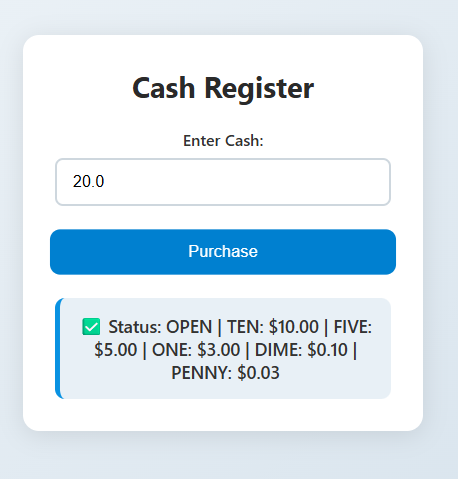

# 💰 Cash Register

A simple and responsive web application that calculates **change due** for a purchase.  
Built with **HTML**, **CSS**, and **JavaScript** as part of FreeCodeCamp projects.

---



---

## 🚀 Live Demo
👉 [View the live app on GitHub Pages](https://stabat47.github.io/cash-register/)

---

## ✨ Features
- ✅ Calculates change due for a fixed item price  
- ✅ Handles exact payment, insufficient funds, and closed/open cash drawer scenarios  
- ✅ Input validation with clear warning messages  
- ✅ Clean, card-style output for readability  
- ✅ **Responsive design** for desktops, tablets, and mobile devices  
- ✅ Lightweight, no external frameworks

---

## 🛠️ Technologies Used
- **HTML5** – semantic structure of the page  
- **CSS3** – responsive and modern styling  
- **JavaScript (ES6)** – calculation logic and interactivity  

---

## 📂 Project Structure
```bash
Cash-Register/
│
├── index.html      # Main HTML file
├── styles.css      # Stylesheet for layout and styling
├── script.js       # JavaScript logic for calculating change
└── README.md       # Project documentation
```

## 📖 How to Use

1. Open the project folder and launch `index.html` in your browser.  
2. Enter the cash amount provided by the customer in the input field.  
3. Click the **Purchase** button.  
4. The app will display the change due, or an appropriate status message:
   - **No change due** – for exact payment  
   - **Status: OPEN** – with denominations for standard change  
   - **Status: CLOSED** – if cash drawer is emptied exactly  
   - **Status: INSUFFICIENT_FUNDS** – if not enough cash or denominations are insufficient  
5. Adjust the cash input and try again as needed.

---

## 🖥️ Responsive Design

The project adjusts seamlessly to all screen sizes:  

- 📱 **Mobile-friendly interface**  
- 💻 **Tablet and desktop-friendly layout**  
- Uses flexible widths, responsive font sizes, and media queries to ensure usability on all screens

---

## 💡 About Cash Register Logic

- Uses a fixed **item price** and a **cash-in-drawer (CID) array** to calculate change  
- Determines the **optimal denominations** to give as change  
- Handles edge cases like **insufficient funds** or **exact drawer depletion**

---

## 🙌 Acknowledgements

Inspired by **[freeCodeCamp](https://www.freecodecamp.org/)** JavaScript project challenges

---

## 📬 Contact

Created by [@Stabat47](https://github.com/Stabat47) — feel free to reach out via email: **clensylandoh@gmail.com**

---

## 📜 License

This project is licensed under the **MIT License** — feel free to use and modify it
